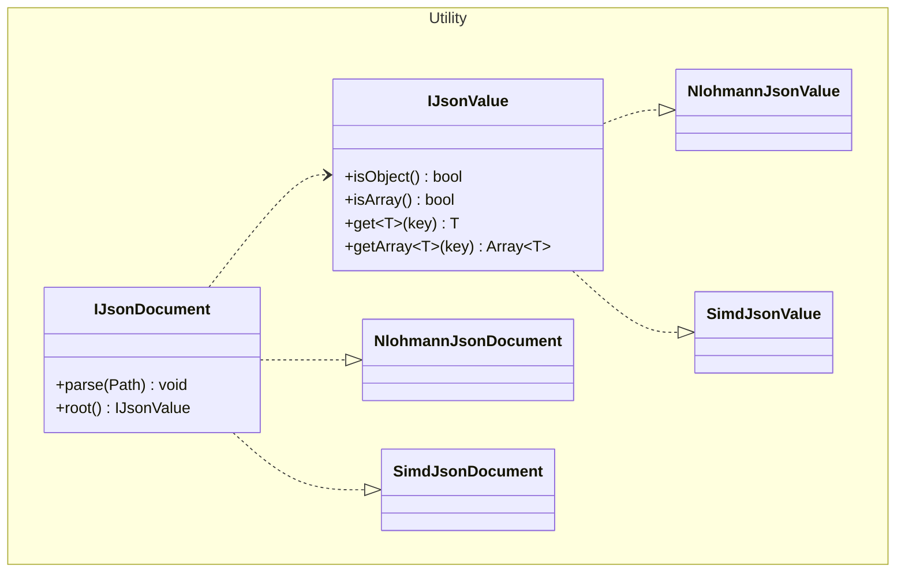

# Architecture for the JSON Reading Backend and Frontend Within the Engine

> Felix Hommel, 3/10/2026

The JSON Reading within the engine should be flexible and adaptable so that a change of backend is easy and stress-free.
This allows us to start with i.e., a nlohmann/json solution and change to a simdjson solution if it later becomes
evident that we need something that has better performance.

> Note that nlohmann/json and simdjson are not the only possible option.

## Simple Architecture

This represents a combined Facade and Adapter pattern based approach to hide the JSON operations behind a generalized
facade which is connected to specific JSON libraries with adapters. Then DIP can be used to inject a JSON reader into
the engine.
