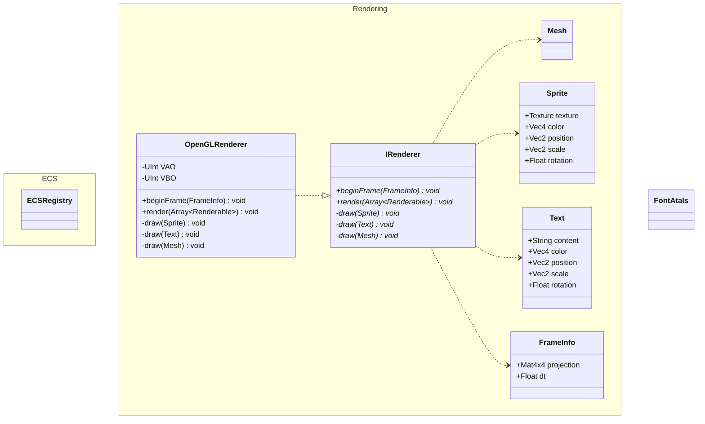

# Concerns and Suggestions to Improve the Rendering Backend

Currently the Rendering is very intertwined with what we can render. We have a ```SpriteRenderer``` and
```TextRenderer```, both of which abstract away drawing behavior with a ```draw(...)``` function that requires numerous
arguments to be provided. Besides the fact that this approach carries the burden of state management, it also comes
with the added disadvantage of code repetition (i.e., ```beginFrame(...)``` method in both renderers).

## Overview of the Problem Infrastructure


There are a few things in this entire system that makes sense. For example, it makes sense that something that renders
text text using FreeType needs access to FreeType, and things that need Rendering need access to OpenGL. What is
suboptimal, is that they are not labeled with the things they are using and that there is no common interface to use
the services they provide. What that means is that everyone that uses Rendering is directly depending on OpenGL and FreeType.

## Alternative: Rendering and ECS Separation

Currently, the ECS and renderer are very intertwined. This is an issue because rendering and ECS systems are designed
to do very different things. ECS systems are here to read component data, modify component data, and then write the
modified component data. This is fundamentally different to the data flow used in rendering where the renderer is
reading component data and then uses the data to produce an image that can be presented to the screen. To overcome this
problem, I propose the following architecture:



In this design ```OpenGLRenderer``` would be responsible for creating one quad and registering a VAO and VBO for it.
This quad can then be used across all sprite draws since it is only needed to project a color or texture onto it.
For meshes (only relevant in the future) it is slightly different, those would have to be brought by the ```Mesh```
primitive since it is not feasible nor realistic to load meshes each frame. It might be fine to couple
```OpenGLRenderer``` with ```FreeType```, I am currently not sure if it is needed nor beneficial to abstract
text rendering at this point. The introduction of a font atlas however is reasonable and should be done.