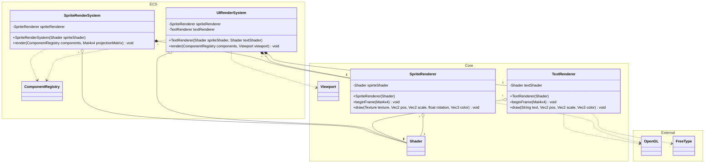
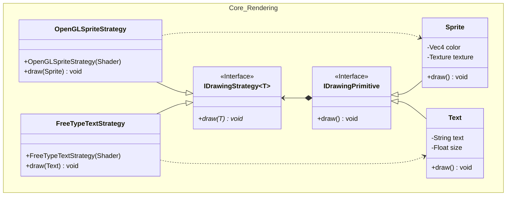
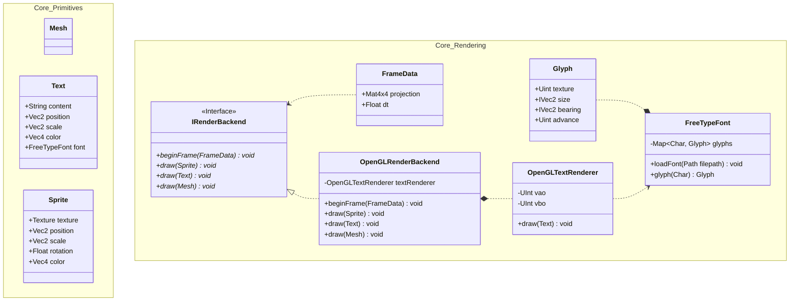

# Concerns and Suggestions to Improve the Rendering Backend

Currently the Rendering is very intertwined with what we can render. We have a ```SpriteRenderer``` and
```TextRenderer```, both of which abstract away drawing behavior with a ```draw(...)``` function that requires numerous
arguments to be provided. Besides the fact that this approach carries the burden of state management, it also comes
with the added disadvantage of code repetition (i.e., ```beginFrame(...)``` method in both renderers).

## Overview of the Problem Infrastructure



There are a few things in this entire system that makes sense. For example, it makes sense that something that renders
text text using FreeType needs access to FreeType, and things that need Rendering need access to OpenGL. What is
suboptimal, is that they are not labeled with the things they are using and that there is no common interface to use
the services they provide. What that means is that everyone that uses Rendering is directly depending on OpenGL and FreeType.

## Proposal: Implement a Strategy-Pattern Based Solution (Per Drawable)

When using a strategy based solution, it would be possible to abandon the rigid rendering structure and replace them
with simple drawing primitives. These drawing primitives are then responsible for providing the rendering strategy with
what is needed to draw the primitive (This means i.e., a sprite provides a texture, rotation, position, ... to the strategy).



This system then could be implemented like this (semi-implementation, just for conceptual idea):

```cpp
class IDrawingPrimitive
{
public:
    IDrawingPrimitive() = default;
    virtual ~IDrawingPrimitive() = default;

    virtual void draw() const = 0;
};

class Sprite : public IDrawingPrimitive
{
public:
    explicit Sprite(glm::vec4 color, std::shared_ptr<DrawStrategy<Circle>> strat)
        : m_strategy{ std::move(strat)
        , m_color{ color }
    {}

    explicit Sprite(glm::vec4 color, std::shared_ptr<Shader> shader)
        : m_strategy{ std::make_unique<OpenGLSpriteStrategy>(std::move(shader)) }
        , m_color{ color }
    {}

    void draw() const override { m_strategy->draw(*this); }

private:
    std::unique_ptr<DrawStrategy<Sprite>> m_strategy;
    glm::vec4 m_color;
};

template<typename T>
class DrawStrategy
{
public:
    virtual ~DrawStrategy() = default;

    virtual void draw(const T&, /* potential other arguments */) const = 0;
};

class OpenGLSpriteStrategy : public DrawStrategy<Sprite>
{
public:
    OpenGLSpriteStrategy(std::shared_ptr<Shader> shader, /* drawing related arguments */);

    void draw(const Sprite& s, /* potential other arguments */) const override;

private:
    std::shared_ptr<Shader> m_shader;
};
```

This system can be combined with free-functions that are used to setup the frame global state
(i.e., setting projection matrix, transparency, stencil, ...) with functions like ```void beginOpenGLFrame(...)```

That means that every primitive carries its own way of rendering with it as a data member while keeping the benefit of being lightweight.

### Critical Considerations

- Examine the overhead of creating an OpenGL buffer per sprite. That would be an implied restriction, when every sprite
  has its own strategy, that would mean that the strategy would need to handle creating an OpenGL buffer for
  the primitive. That is because every Sprite needs a quad to project the texture or color onto.

  - Same problem with the Text primitive, possibly even worse if each strategy would need to load its own font and
    create glyphs from that font

- How can every used shader know about the current projection matrix when setting the frame global data?

## Proposal: Implement a Command + Strategy Based Solution

This approach would avoid the issues of the prior solution which had a strategy per drawable, that would've caused a
violation of the SRP because a Sprite then would have been responsible for data maintenance and rendering.

Here, render primitives become pure data containers that do not manage anything else than maintaining the data they contain.


