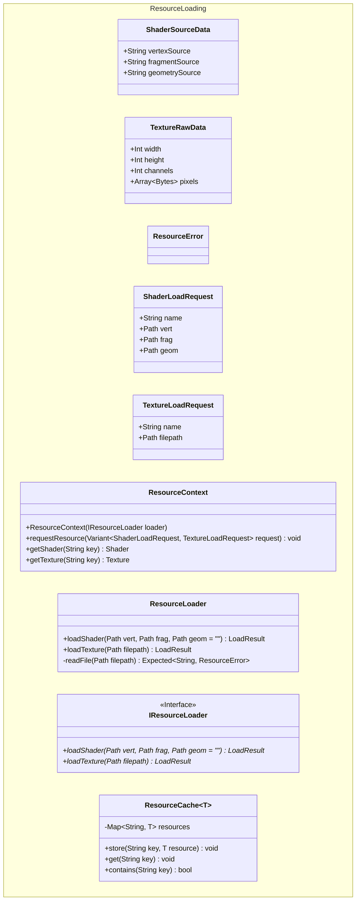

# Architecture Decisions for Resource Loading

> Felix Hommel, 2/28/2026

The resource loading and management system is designed to be working in parallel. That means resource loading is a
multithreading task. This can be achieved by separating resource loading in two separate stages:

1. Load the raw data from disk
2. Upload OpenGL resource to the GPU

Step 1 is the part that can benefit from multithreading since every resource can be loaded by a separate thread which
then can save the raw data (i.e., shader source code, image pixel data). In step 2, the main thread then can create
OpenGL resources from the raw data and upload the relevant parts to the GPU. The upload process needs to be done by the
thread that creates the OpenGL context, the main thread, because of the way OpenGL handles its context.

