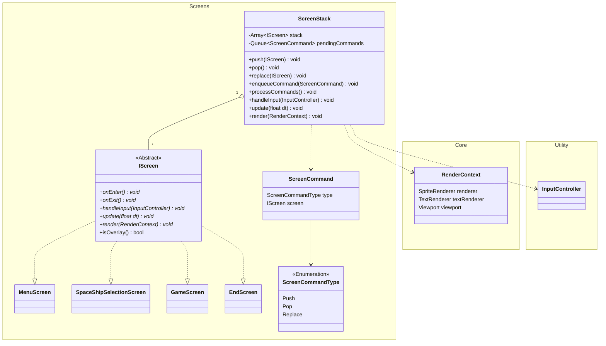

# Architecture Decisions for the Screen System

> Felix Hommel, 3/2/2026



A top level orchestrator would then be able to manage the ```ScreenCommands``` to manipulate the ```ScreenStack```.

## Rendering Order

Given overlays should be on top of non-overlay screens, the queue has to traversed from top down to the first
non-overlay screen and then rendered from there to the top. This ensures that all overlays are over the main game screen
and in the proper order.

## Input Propagation

Compared to rendering order, input propagation should work exactly the other way around. Overlays usually should stop
events from being passed down the screen chain if the overlay can consume the event. If the overlay can not consume
the event, it can be passed down one layer further.
