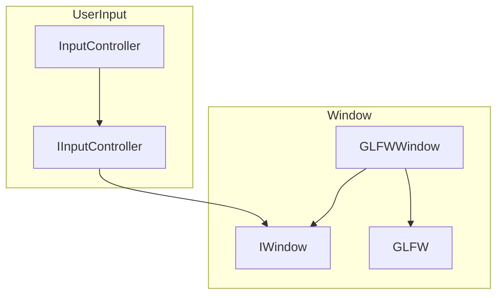
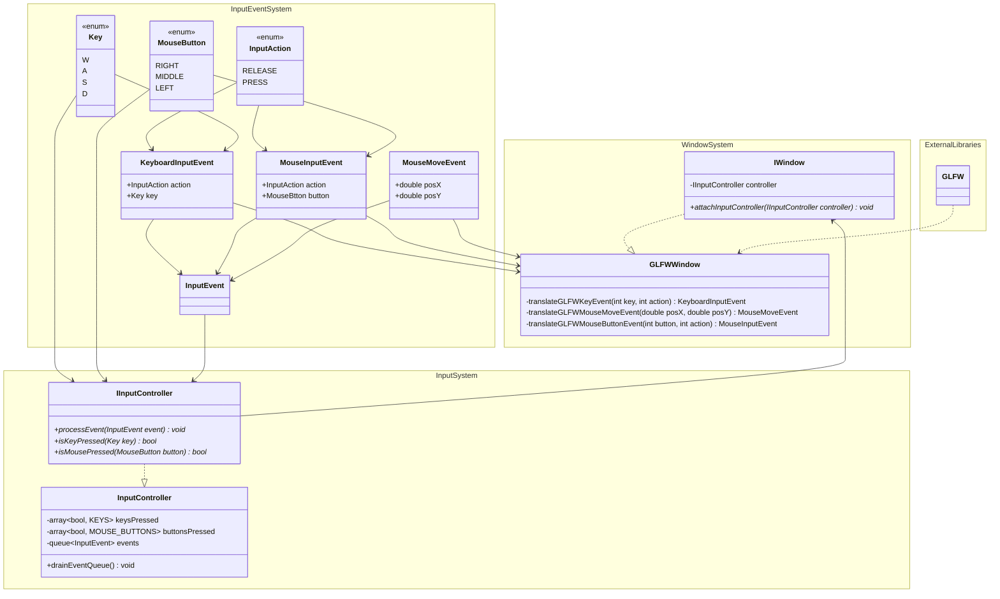

# Diagrams for the Window and User Input Abstraction

## Dependency Flowchart

The ```IWindow``` and ```IInputController``` system are closely related to each other, because in many windowing libraries
(i.e., GLFW) user input is coupled with window events. The engine should not be restricted by this coupling and should
not be dependent on a specific windowing library.



## Class Diagram

This class diagram shows the conceptual architecture using adapters to translate GLFW events to an engine native event
format, thereby directly eliminating close coupling of GLFW into the engine. All that while keeping the concerns as
much separated as possible.



## Implementation Details

The 3 types of event can be perfectly represented by a ```std::variant``` based approach. That way the
```IInputController::processEvent(const InputEvent& event)``` method can easily use ```st::visit``` to process all 3 types of
events.
Other than that, there is a consideration to make in the ```InputController``` class related to the queue-based
event approach:

1. Immediate State Progression
  The event is processed immediately when it is inserted into the queue.
2. Insert Queue + Process Separately
  Here, the events are inserted into the queue, and then processed once per game loop iteration.
